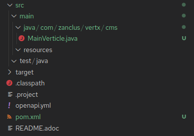

# Vert.x Headless CMS Example Project

## Overview

This application is meant to demonstrate building a REST and WebSockets based application using Eclipse Vert.x. Some of the features and functionality we will used are:

* Vert.x Core EventBus
* Vert.x Clustering
* Vert.x Web, Sessions, Routers, Cookies, and CORS
* Vert.x OpenAPI
* Vert.x Web API Service
* Vert.x Auth with OAuth2
* Vert.x WebSockets & Service Proxies
* Using Reactive Hibernate For Data Persistence
* OpenTracing
* Health Checks
* [SmallRye Mutiny](https://smallrye.io/smallrye-mutiny/)


For this CMS application, we will implement the OpenAPI Specification linked [here](openapi.yml).

## How To Follow This Example

Each step of the journey will be a new branch in the form of `Step_XXX`, where `XXX` are incrementing numbers for each successive step. In fact, the next step you should look at after this trunk branch should be `Step_001`. Follow the instructions in each branch to continue building your Vert.X Headless CMS application.

## Step 001 - Create The Initial Vert.x Application

To get started, we will need to "bootstrap" our Vert.x application. There are a couple of different ways that we can do this.

### Vert.x Web Starter

This is a [web site](https://start.vertx.io/) where you can create your initial Vert.x application and choose which Vert.x modules to include
in your application.

### Vert.x Maven Plugin

This is the method I will use to create this application, but it should be pretty much the same outcome as the web starter.

```
$ mvn io.reactiverse:vertx-maven-plugin::setup
WARNING: An illegal reflective access operation has occurred
WARNING: Illegal reflective access by com.google.inject.internal.cglib.core.$ReflectUtils$1 (file:/usr/share/maven/lib/guice.jar) to method java.lang.ClassLoader.defineClass(java.lang.String,byte[],int,int,java.security.ProtectionDomain)
WARNING: Please consider reporting this to the maintainers of com.google.inject.internal.cglib.core.$ReflectUtils$1
WARNING: Use --illegal-access=warn to enable warnings of further illegal reflective access operations
WARNING: All illegal access operations will be denied in a future release
[INFO] Scanning for projects...
[INFO] 
[INFO] ------------------< org.apache.maven:standalone-pom >-------------------
[INFO] Building Maven Stub Project (No POM) 1
[INFO] --------------------------------[ pom ]---------------------------------
[INFO] 
[INFO] --- vertx-maven-plugin:1.0.22:setup (default-cli) @ standalone-pom ---
[INFO] No pom.xml found, creating it in /home/dphillips/Documents/Zanclus/Workspace/vertx-forum
Set the project groupId [io.vertx.example]: com.zanclus.vertx
Set the project artifactId [my-vertx-project]: headless-cms
Set the project version [1.0-SNAPSHOT]: 1.0.0-SNAPSHOT
Set the Vert.x version [3.8.2]: 4.0.0
Set the verticle class name [com.zanclus.vertx.MainVerticle]: com.zanclus.vertx.cms.MainVerticle
[INFO] Creating verticle com.zanclus.vertx.cms.MainVerticle
[INFO] Creating directory /home/dphillips/Documents/Zanclus/Workspace/vertx-forum/src/main/java/com/zanclus/vertx/cms
[INFO] ------------------------------------------------------------------------
[INFO] BUILD SUCCESS
[INFO] ------------------------------------------------------------------------
[INFO] Total time:  01:05 min
[INFO] Finished at: 2021-01-16T11:28:28-05:00
[INFO] ------------------------------------------------------------------------
```

And you will end up with a directory structure like this:

.Directory Structure

